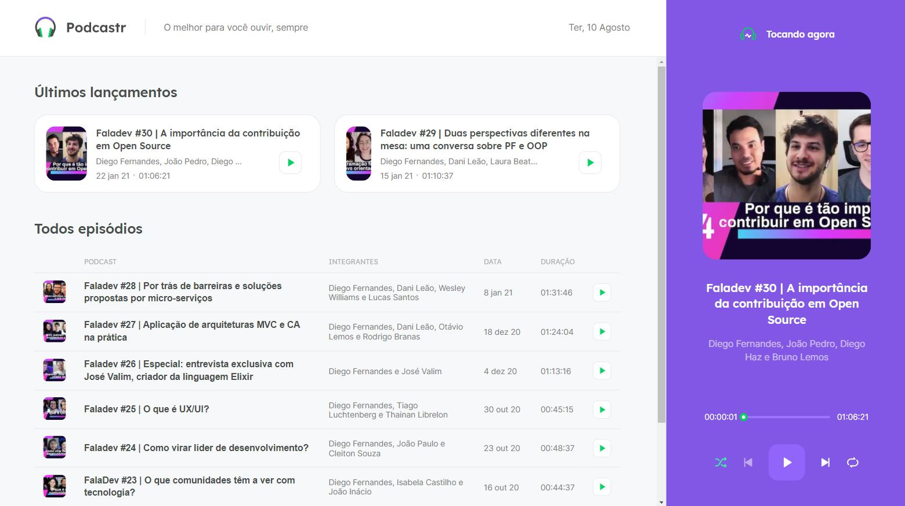

<h1 align="center">
    
</h1>

<p align="center">
  <a href="#-project">Project</a>&nbsp;&nbsp;&nbsp;|&nbsp;&nbsp;&nbsp;
  <a href="#-technologies">Technologies</a>&nbsp;&nbsp;&nbsp;|&nbsp;&nbsp;&nbsp;
  <a href="#-how-to-run">How to run</a>
</p>

<p align="center">
  
</p>

## 💻 Project

Podcastr is a podcast application with content from Rocketseat's "Faladev".

## 🔧 Technologies

- [Next.js](https://nextjs.org/)
- [TypeScript](https://www.typescriptlang.org/)
- [Sass](https://sass-lang.com/)

## 😊 How to run

Before starting, you need to have [Git](https://git-scm.com) and [Node](https://nodejs.org/en/) installed on your machine.

```sh
- Clone this repo:
$ git clone https://github.com/marcelopajr/podcastr.git

- Enter directory:
$ cd podcastr

- Install dependencies:
$ npm install

- Launch the server:
$ npm run server

- Launch the app:
$ npm run dev
```

Have fun!
